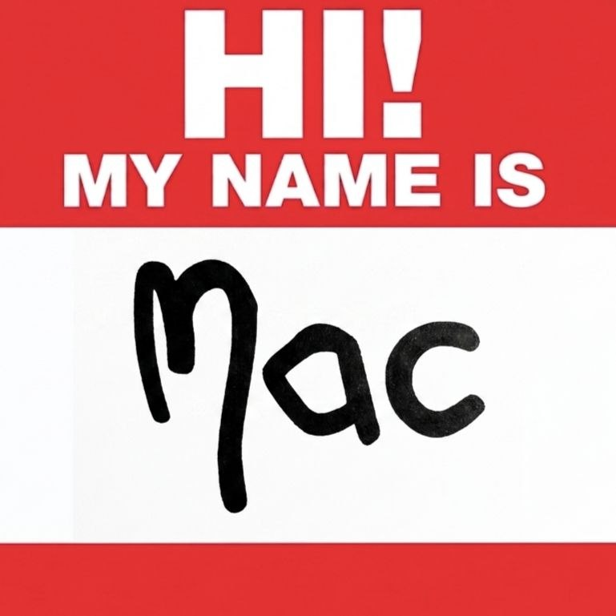

# met-me

> Un bot Telegram di supporto emotivo. Ascolto, empatia, niente giudizio.

<br clear="left">


**met-me** è un assistente conversazionale basato su LLM (Claude o Ollama, intercambiabili a caldo) pensato per offrire uno spazio d'ascolto sicuro e accogliente. Persona configurabile, knowledge base via RAG, tracciamento dello stato emotivo (*rock-bottom tracker*) con alert agli amministratori e ricerca web on-demand tramite tool calling.

Il bot di default si chiama **Mac** — *"Be you. You'll be fine."*

---

## ✨ Caratteristiche

- 🤖 **Due provider LLM**: Anthropic Claude (cloud) e Ollama (locale), selezionabili runtime da `/model`.
- 📚 **RAG su documenti**: drag-and-drop di file (`.txt`, `.md`, `.pdf`, `.docx`) nella chat (admin) per arricchire la knowledge base. Indicizzazione incrementale via LlamaIndex + Chroma + embeddings Ollama.
- 💚 **Rock-bottom tracker**: ogni messaggio utente viene classificato 0–10 da un LLM separato (0 = "rock bottom", 10 = positivo). Se la media mobile scende sotto soglia, gli admin ricevono un alert con i messaggi più critici.
- 🔧 **Tool calling**: il modello può chiamare `search_web` (DuckDuckGo via `ddgs`) quando servono informazioni aggiornate. Layer tool-agnostic con adapter per Anthropic e Ollama.
- 🗄️ **Persistenza SQLite**: utenti, cronologia conversazioni, rock-bottom scores, impostazioni. Niente stato in memoria.
- 📝 **Logging strutturato**: log applicativo rotante + un file per utente (`logs/{user_id}.log`) con colonne fisse `tipo | modello | testo`.
- 🎭 **Persona configurabile**: nome, welcome, prompt, comandi visibili — tutto in `persona.yaml`.
- ⚙️ **Zero default magici**: ogni tunable (chunk size, top-k, soglia rock-bottom, finestra storico…) vive in `.env`. Missing var = fail-fast all'avvio.

---

## 🏗️ Architettura

```
┌─────────────┐      ┌──────────────────────────────┐
│  Telegram   │◄────►│  bot.py (handlers + routing) │
└─────────────┘      └──────────────┬───────────────┘
                                    │
       ┌────────────┬───────────────┼─────────────────────┬──────────────┐
       ▼            ▼               ▼                     ▼              ▼
   ┌────────┐  ┌─────────┐    ┌───────────┐    ┌────────────────┐  ┌──────────┐
   │ db.py  │  │ llm.py  │    │  rag.py   │    │ rock_bottom.py │  │ tools.py │
   │SQLite  │  │Claude / │    │LlamaIndex │    │ scoring        │  │search_web│
   │        │  │Ollama   │    │+ Chroma   │    │ + alert        │  │  (DDG)   │
   └────────┘  └─────────┘    └───────────┘    └────────────────┘  └──────────┘
```

| File | Ruolo |
|------|-------|
| [bot.py](bot.py) | Entry point: handlers Telegram, routing, logging, bootstrap |
| [config.py](config.py) | Caricamento `.env` + `persona.yaml`, fail-fast su missing vars |
| [db.py](db.py) | SQLite async (worker thread), schema `users` / `messages` / `rock_bottom_scores` / `settings` |
| [llm.py](llm.py) | Provider Claude e Ollama dietro interfaccia comune, tool-use loop |
| [rag.py](rag.py) | Ingestion incrementale con manifest, query su Chroma |
| [rock_bottom.py](rock_bottom.py) | Classificatore 0–10 via LLM, parsing JSON robusto |
| [tools.py](tools.py) | Registry tool-agnostic + adapter Anthropic/Ollama |
| [persona.yaml](persona.yaml) | Nome, welcome, comandi, system prompt |

---

## 🚀 Quick start

### Prerequisiti

- Python ≥ 3.11
- [Ollama](https://ollama.com/) in esecuzione locale (serve sia per gli embeddings RAG sia per il provider locale opzionale)
- Bot token Telegram da [@BotFather](https://t.me/BotFather)
- (Opzionale) API key Anthropic per Claude

### Installazione

```bash
git clone https://github.com/mttpzz/met-me.git
cd met-me

python -m venv .venv
# Windows
.venv\Scripts\activate
# Linux / macOS
source .venv/bin/activate

pip install -r requirements.txt
```

### Modelli Ollama

```bash
# Embedding model per il RAG
ollama pull nomic-embed-text

# Modello chat locale (se userai il provider ollama)
ollama pull llama3.2
```

### Configurazione

Crea `.env` nella root del progetto:

```env
# ---- Telegram ----
TELEGRAM_TOKEN=123456:ABC-DEF...
# Comma-separated Telegram user IDs allowed to run admin commands
ADMIN_IDS=111111111,222222222

# ---- Anthropic (Claude) ----
ANTHROPIC_API_KEY=sk-ant-...
ANTHROPIC_MODEL=claude-sonnet-4-6
# Max output tokens per response
CLAUDE_MAX_TOKENS=1024

# ---- Ollama (local) ----
OLLAMA_HOST=http://localhost:11434
OLLAMA_MODEL=llama3.2

# ---- Defaults ----
# Initial provider: "claude" or "ollama"
DEFAULT_MODEL=claude

# ---- Paths ----
PERSONA_FILE=persona.yaml
DB_PATH=db/met-me.db

# ---- History ----
# Number of (user+assistant) turn pairs replayed to the LLM each request
HISTORY_MAX_TURNS=20

# ---- RAG ----
EMBEDDING_MODEL=nomic-embed-text
RAG_PATH=rag
# Top-K document chunks retrieved per turn
RAG_TOP_K=5
# Chunk size / overlap in tokens (chunk must fit within RAG_EMBED_NUM_CTX)
RAG_CHUNK_SIZE=256
RAG_CHUNK_OVERLAP=32
# Embed model context window (nomic-embed-text supports up to 8192)
RAG_EMBED_NUM_CTX=8192

# ---- Rock-bottom tracker ----
# Rolling window size and threshold (0..10). Alert fires when avg drops below
# threshold AND the window is full. 0 = "rock bottom".
ROCK_BOTTOM_WINDOW=10
ROCK_BOTTOM_THRESHOLD=4.0
# Lowest-scoring recent user messages attached to each alert
ROCK_BOTTOM_ALERT_LOW_MSGS=10
```

### Avvio

```bash
python bot.py
```

Al primo run viene creato lo schema SQLite, indicizzata la cartella `rag/docs/` (se contiene file) e sincronizzato il profilo del bot su Telegram.

---

## 💬 Comandi

### Utente

| Comando | Cosa fa |
|---------|---------|
| `/start` | Messaggio di benvenuto |
| `/help` | Lista comandi |
| `/reset` | Cancella la cronologia conversazione dell'utente |

### Admin

| Comando | Cosa fa |
|---------|---------|
| `/model` | Mostra il modello attivo |
| `/model claude\|ollama` | Switch del provider |
| `/users` | Elenco utenti registrati |
| `/stats` | Statistiche: utenti, messaggi per ruolo/modello, top users |
| `/reindex` | Re-indicizzazione completa di `rag/docs/` |

**Upload documenti**: un admin che invia un file in chat lo deposita in `rag/docs/` e lo indicizza automaticamente.

---

## 🧠 Personalizzare il bot

Tutta la personalità vive in [persona.yaml](persona.yaml):

```yaml
name: Mac
short_description: Be you. You'll be fine.
welcome: |
  Hi, my name is Mac 👋
help_user:
  - /start - welcome message
  - /help - this list
  - /reset - clear the conversation history
help_admin:
  - /model - show the active model
  - /model claude|ollama - switch model
prompt: |
  Ruolo: Agisci come un assistente di supporto emotivo...
```

Modifica nome, welcome e prompt per ottenere un assistente con tono completamente diverso (coach, tutor, supporto clienti, ecc.). Il bot al riavvio aggiorna automaticamente il proprio profilo Telegram (con dedup per evitare i rate-limit aggressivi delle API di profilo).

---

## 🔒 Note sulla sicurezza e sull'uso

Il bot **non sostituisce un professionista della salute mentale**. Il system prompt include istruzioni esplicite per:

- Riconoscere segnali di crisi acuta e indirizzare l'utente a contatti d'emergenza
- Evitare diagnosi e linguaggio clinico
- Validare prima di proporre

Gli admin ricevono alert proattivi quando la media mobile dello stato emotivo di un utente scende sotto soglia, con allegati i messaggi a punteggio più basso per contesto. Usalo con responsabilità.

---

## 🗂️ Layout dati

```
met-me/
├── db/met-me.db           # SQLite (gitignored, path da DB_PATH)
├── logs/
│   ├── bot.log            # log applicativo rotante
│   └── {user_id}.log      # un file per utente
└── rag/
    ├── docs/              # documenti sorgente (gestiti da admin)
    └── index/             # persistenza Chroma + manifest.json (gitignored)
```

---

## 📦 Stack tecnico

- [python-telegram-bot](https://github.com/python-telegram-bot/python-telegram-bot) `21.6`
- [anthropic](https://github.com/anthropics/anthropic-sdk-python) ≥ 0.39
- [ollama](https://github.com/ollama/ollama-python) ≥ 0.3
- [llama-index](https://github.com/run-llama/llama_index) ≥ 0.14 + [chromadb](https://github.com/chroma-core/chroma) ≥ 1.5
- [ddgs](https://pypi.org/project/ddgs/) per web search
- SQLite (stdlib)

---

## 🎵 Liner notes

Il progetto contiene dei riferimenti a tre artisti che con la loro musica hanno raccontato salute mentale, identità e vulnerabilità meglio di tanti manuali.

- 💬 **Mac Miller** — il bot si chiama **Mac** e la sua `short_description` è *"Be you. You'll be fine."* Tributo a un artista che della fragilità e della cura di sé ha fatto un linguaggio.

- 🎭 **Marracash** — il file [persona.yaml](persona.yaml) prende il nome dall'album *Persona* (2019). In quel disco ogni traccia è una parte del corpo o un frammento di identità. La stessa idea è ripresa qui: `persona.yaml` è l'insieme delle "parti" che compongono il bot.

- 👋 **Eminem** — il messaggio di benvenuto del bot, *"Hi, my name is Mac 👋"*, è un occhiolino al singolo *My Name Is*. Anche l'immagine profilo del bot richiama la copertina del singolo: il cartellino "HI! MY NAME IS" con "Mac" al posto di "Slim Shady". Presentazione diretta, niente fronzoli.

Grazie per la musica. 🙏

---

## 📄 Licenza

[MIT](LICENSE) © 2026 Matteo Pozzi
